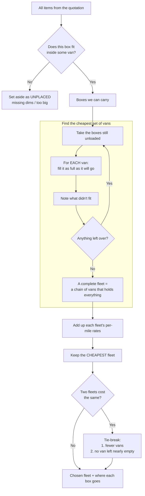
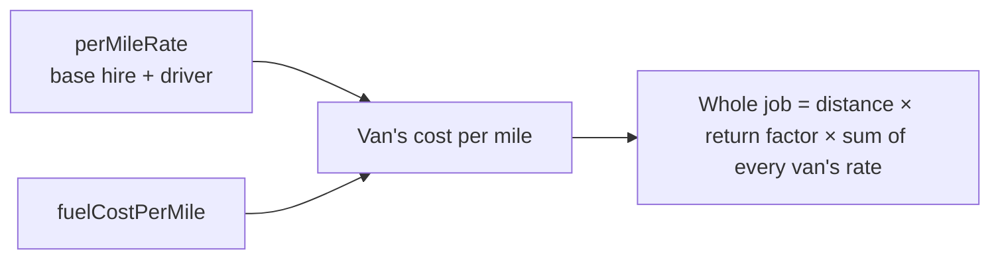

# Fleet Allocation & Quote Pricing

How the system decides **which vans carry a job, how cargo is split across them, and
what the customer pays** — including the return drive.

The objective is a single thing: **the cheapest set of vans that still carries every
item.** Fewer vans and fuller vans are only used to break ties.

Code: `src/lib/packing/fleet-allocator.ts` · cost model: `src/lib/packing/van-cost.ts`
· pricing: `src/lib/pricing/calculator.ts`.

> **This doc is in two halves.**
> **§1–§6 — how distribution works *today*** (the shipped algorithm, from first principles).
> **The second half — how it *should* evolve** to distribute cargo more intelligently
> across a fleet, with a model that scales from a two-van operator to a large carrier.
> Read §1–§6 to understand the current behaviour; read the second half for the upgrade path.

> **Note on weight.** The fleet config currently inflates `maxPayloadKg` ~20× (see the
> `_note` in `config/vans.json`) so weight never gates placement while stacking is being
> tuned. This doc therefore explains allocation as it actually behaves **today: driven by
> space and cost, not weight.** Where weight *will* matter once realistic payloads are
> restored is flagged inline.

---

## 1. The question, from first principles

A quotation is just **a pile of boxes**. We have a catalogue of vans, each a different
size and a different price-per-mile. Two questions follow, in order:

1. **Does each box fit *any* van at all?** If not, it can't travel — flag it and move on.
2. **For the boxes that do fit, which combination of vans carries the whole pile for the
   least money?** One big van? Two small ones? The answer is whatever is cheapest.

That second question is the entire job. Everything below is just *how we search for the
cheapest answer without missing a better one.*



`allocateFleet` runs this as an **exhaustive search**: it genuinely tries every
mix-and-match of vans, not a quick guess. At each step it:

1. takes every van still available and **fills it as densely as the packer allows** with
   the boxes that remain;
2. recurses on whatever didn't fit (`result.unplaced`) — that becomes the next van's job;
3. costs each *complete* fleet and keeps the cheapest, remembering answers it has already
   computed (memoised on remaining-cargo + van availability) so it never re-solves the
   same sub-pile twice.

> **Large jobs** cap the exhaustive search at ~1,500 combinations, then a fast greedy
> finish (pick the most volume-per-£ van each step) completes the rest, so it always
> terminates.

---

## 2. Why a box goes in *this* van and not *that* one

There is **no rule that says "fragile goes here" or "heavy goes there."** A box lands in
a particular van purely as a side-effect of one goal: *carry everything for the least
total money.* The only hard gate is **geometry** — a box must physically fit the van's
interior in some rotation (the 3D packer checks all 6 orientations unless the item is
orientation-locked).

So the decision for each van is really just:



Because **distance is the same for every van on the trip**, it drops out of the
comparison — the search only ever has to minimise the **sum of the vans' per-mile
rates**. A cheap small van pulls cargo toward itself; an expensive large van only earns
its place when it removes the need for *two* smaller ones.

> **When weight is restored:** `fuelCostPerMile` will scale up with how heavily a van is
> loaded (≈15% more fuel at full payload), and a van will be refused once its real
> `maxPayloadKg` is exceeded — pushing the overflow into the next van. Today, with
> inflated payloads, neither effect bites, so allocation is space-and-rate only.

---

## 3. The factors the decision weighs today

| Factor | Role in the current model |
|---|---|
| van interior L×W×H | **Hard limit** — gates what physically fits (the 3D packer) |
| `perMileRate` | **The number minimised** — sum across the chosen vans |
| `fuelCostPerMile` | Added to the rate (flat today; payload-scaled once weights are real) |
| van `quantity` | How many of each model are available to draw on |
| `ROUTE_RETURN_FACTOR` | Multiplies billed distance (1 = one-way, 2 = round trip) — §5 |
| tie-breakers | fewer vans, then fuller vans — **only** on a cost tie (`betterAllocation()`) |
| ~~`maxPayloadKg`~~ | *Inert today* (inflated ~20×); will become a hard weight gate later |

---

## 4. Why "Medium ¾ full + Small 100% full" happens

It is **emergent, not a rule**. Across every combination tried, that pairing carried all
the boxes at the lowest summed rate: a small van is cheap per mile, so filling it
completely and topping up with the *minimum* extra capacity (a part-full medium) beats
running two larger, half-empty vans. Nothing "aims" to fill the small van first —
cheapest-overall simply lands there.

---

## 5. What a real dispatcher weighs that this model doesn't (yet)

The model above is honest about being **purely cost-and-fit**. A human planning the same
load considers a wider set of forces, and these are exactly the levers that decide
"product A in van 1, product B in van 2" in the real world:

| Real-world factor | Why it changes the allocation | Status here |
|---|---|---|
| **Fragility / stackability** | Glass can't sit under an engine block; some boxes can't bear weight, so they need their own floor space even if volume is free | Stacking matrix exists (`config/stackability.json`); not yet a cost driver |
| **Door aperture** | A box can fit the *interior* but not through the *doors* — it must go in a van it can actually be loaded into | `doorAperture` is in config, not yet enforced in allocation |
| **Drop sequence** | Multi-stop runs load last-in-first-out: the first delivery rides near the doors, which constrains which van each drop's items go in | Not modelled — single origin→destination assumed |
| **Weight & axle limits** | Real payload and weight distribution decide if a heavy item splits off into its own vehicle | Inert today (payloads inflated); planned |
| **Value / security** | High-value or hazardous goods may be deliberately *not* consolidated, or kept in a specific vehicle | Not modelled |
| **Driver hours / depot** | A van already near the route, or a driver with hours left, is cheaper in reality than rate alone implies | Not modelled — flat per-mile rate only |
| **Return loads** | A van that can pick up cargo on the way back is effectively cheaper for this leg | Not modelled — see `ROUTE_RETURN_FACTOR`, §5 |

The shipped algorithm deliberately reduces all of this to **fit + rate** so the answer is
deterministic and explainable. The second half of this doc describes how to layer these
real forces back in without losing that property.

---

## 6. Return journey

Pricing is per-van full-route: every vehicle is billed for the same origin→destination
distance. A single config knob covers the drive home:

- `ROUTE_RETURN_FACTOR` (routing block, `src/config/env.ts`): `1.0` = one-way, `2.0` =
  full round trip (van returns to base). Default `2.0`.
- Applied in `calculateQuote`: `billedMiles = route.distanceMiles × returnFactor`,
  multiplying **both** the distance and the payload-adjusted fuel line items.
- The reported `route.distanceMiles` stays the true **one-way** figure; only billed
  miles scale. Labels show the factor, e.g. *"Distance (200.0 mi × 2 round trip @
  £1.28/mi)"*.

Because the factor multiplies **every** van's cost equally, it does **not** change the
fleet chosen in §1 — the relative ordering of combinations is preserved.

---
# How it *should* work — a smarter distribution model

Everything in §1–§6 answers *"which set of vans is cheapest per mile."* That is the wrong
objective for the real decision, and it is **why the model can't reason about how to split
a load.** This half sets out the objective it *should* optimise, and the real-world forces
that objective has to carry.

> **The one-sentence upgrade.** Stop minimising the **summed per-mile rate** of the chosen
> vans and start minimising the **total quoted cost of the whole job** — distance + payload-
> scaled fuel + per-van driver labour and handling + any licence-class driver premium —
> subject to fit, door aperture, *real* weight and axle limits, stackability, and drop
> sequence. Once the cost function is complete, the cargo split stops being an accident of
> packing order and becomes the variable the optimiser actually tunes.

---

## 7. The real question is *assignment*, not packing

Your instinct is right: once the cargo fits, the open question isn't "does it fit" — it's
**"why does product A ride in van 1 and product B in van 2, and why not move more into one
and less into the other?"** That is an *assignment* problem (which item goes to which
vehicle), and today the system never actually solves it. The split you see is a **by-product**
of one mechanical habit: the packer fills each van densest-first to the brim, then overflows
whatever is left into the next van. Nobody decided the split; it fell out of the packing order.

Two facts make that by-product wrong, and both are the reason a smarter model *would*
rebalance:

1. **The cost of a van is not linear in how much you load it.** Fuel already rises ~15% from
   empty to full payload (`computeVanCostRate`), and — once realistic weights return — the
   *licence class* of the vehicle is a **step** in cost (§9). A curve that bends means there
   is a genuine optimum split, and it is almost never "cram the first van to the ceiling."
2. **Each extra van carries a fixed cost the allocator can't see.** One more van = one more
   driver wage for the full journey + base hire that **does not scale with distance**, plus
   two site-level overheads that compound with vehicle count: (a) **dock queuing** — most
   depots and customer sites have one receiving bay, so van 2 waits behind van 1 (a paid
   driver sits idle); and (b) **per-vehicle admin** — a proof of delivery (POD) is legally
   vehicle-specific, so every extra van triggers its own sign-off, consignment check, and
   goods-received record at the destination. The physical lifting is the *same total work*
   regardless of how many vans split it; the queuing and paperwork are not. The §1 search
   minimises per-mile rate, so this fixed lump is invisible to it — which is how it can pick
   a 2-van fleet that is genuinely *dearer all-in* than one van.

**A worked example of the rebalance the model misses.** Van&nbsp;1 is the cheap small van;
van&nbsp;2 is a dearer large one running half-empty. The packer crams van&nbsp;1 full — and
its last few items are heavy, pushing it to its weight cap (fuel at the +15% ceiling, and
once weights are real, possibly over a licence line into a costlier driver). Moving two heavy
boxes from van&nbsp;1 into the light van&nbsp;2 leaves van&nbsp;1 **less full by volume but
cheaper**, and barely changes van&nbsp;2. Total cost drops. Today's allocator cannot find that
move, because it scores on per-mile rate alone — where "van&nbsp;1, full" already looks
optimal and the weight-driven fuel, licence, and labour deltas simply don't exist.

| | Today's habit | The smarter split |
|---|---|---|
| **Drives the decision** | densest-first packing order | total job cost |
| **Sees fixed per-van cost?** | no | yes — won't add a van that costs more than it saves |
| **Sees the load→cost curve?** | per-mile rate only | fuel + weight + licence step |
| **Rebalances between vans?** | never (emergent) | yes, whenever it lowers the total |

---

## 8. The factors a smarter allocator must weigh

The two you flagged, plus the forces from §5 that specifically decide *the split*:

| Factor | Why it belongs in the allocation decision | Status in code |
|---|---|---|
| **Van entry size (door aperture)** | A box can fit a van's *interior* in some rotation yet be impossible to get **through the doors** — so door size is a second, independent geometric gate. It can *pin* a bulky item to a van with a big enough aperture regardless of which van is cheapest, reshaping the split. | `doorAperture` in `config/vans.json`; **not enforced** in allocation yet |
| **Payload → cost for that vehicle** | Heavier load means (a) more fuel — already modelled as +15% empty→full in `computeVanCostRate`, so *how you spread weight* changes total fuel; and (b) once real weights return, a **hard cap** that refuses an over-loaded van and forces overflow elsewhere. Because fuel climbs with load, the cheapest split is *not* "fill one van to the cap" — past a point, an extra kg is cheaper in a lighter van. | Fuel curve live but **inert** (`maxPayloadKg` inflated ~20×); hard cap planned |
| **Driver licence class** (§9) | Vehicle weight sets the licence a driver must hold. Bigger vehicle ⇒ higher class ⇒ **fewer drivers legally able to drive it and higher pay**. This turns "use one big truck instead of two vans" from a smooth rate swap into a *step-change* in cost and availability. | **Not modelled** — fleet has no licence/driver-pool data; pricing uses one flat `hourlyRate` for every van |
| **Fixed cost of adding a van** | Each van adds a driver's full-journey wage + base hire, independent of distance. Site-level overheads compound this: dock queuing (van 2 waits for one bay — paid idle time) and per-vehicle POD admin (legally separate sign-off per vehicle at the destination). The physical lifting is the same total work regardless of van count. The §1 search never sees any of this, so it under-prices extra vans. **The single biggest correctness gap.** | Labour line exists in `calculateQuote` but is applied **after** allocation; the search is blind to it |
| **Weight balance / axle limits** | Even within the legal *total* payload, you can't pile all the heavy items in one van — per-axle limits and stability constrain it (an overloaded axle is illegal even at legal GVW). The split must spread weight, not just volume. | Not modelled — flat weight only |
| **Drop sequence (multi-stop)** | Last-in-first-out loading: the first delivery must ride near the doors, which constrains which van each drop's items can go in — re-deciding the split on any multi-stop route. | Single origin→destination assumed |
| **Stackability / fragility** | Fragile or non-load-bearing items need their own floor space even when volume is free, so they consume "expensive" capacity and can force an extra van. | Matrix in `config/stackability.json`; not yet a cost driver |
| **Usable-volume buffer** | A van packed to 99% geometrically is undeliverable in practice (loaders need slack and awkward gaps waste space). Allocating to ~85–90% usable volume yields a split that survives the real loading bay. | Not modelled |
| **Vehicle speed class / delivery window** (§10) | UK law caps heavier goods vehicles at *lower* speeds than vans, and >3.5t vehicles carry a 56 mph limiter — so the same miles take *more drive-hours* in a big truck. That feeds back into both driver cost (priced per hour) and whether a promised delivery time is even achievable. | **Not modelled** — drive time derived from distance only, with no per-class speed |

---

## 9. Driver licence class — the step-change the model ignores

> *Your question: do bigger vans need different licences, so do we need to check which
> drivers are available — and are all drivers paid the same?*

**Short answer: no on both counts, and it matters a lot.** A van driver and a box-truck
driver are not interchangeable and are not paid the same. UK law ties the licence to the
vehicle's **maximum weight (MAM/GVW)**, and our fleet deliberately spans several of those
bands:

| Real vehicle class (GVW) | UK licence | In *our* fleet (`config/vans.json`) | Driver pool & pay vs a van driver |
|---|---|---|---|
| ≤ **3,500 kg** (4,250 kg electric) | **Category B** — ordinary car licence | every panel & Luton van (`micro-panel` … `luton-tail-lift`) | Largest pool; **~£11–15/hr** |
| **3,500–7,500 kg** | **Category C1** | `box-truck-7-5t` (7.5t) | Smaller pool; **~£13–17/hr** + Driver CPC, tachograph, O-licence |
| **> 7,500 kg** rigid ("Class 2") | **Category C** | `box-truck-12t`, `box-truck-18t` | Much smaller pool; **~£16–20/hr** |
| Artic / drawbar over 750 kg trailer ("Class 1") | **Category C+E** | none today | Scarcest; **~£18–24/hr** |

So the moment the allocator reaches for a 7.5t+ box truck to "consolidate into one vehicle,"
it has quietly crossed into a **higher driver class** — which means:

- **Availability isn't guaranteed.** Only a fraction of drivers hold C1/C. A plan that needs
  a 12t truck is worthless if no qualified driver is rostered. The fleet config models how
  many *vehicles* exist (`quantity`) but **nothing about how many qualified drivers do** —
  the constraint that actually limits the bigger vans.
- **The driver costs materially more.** Van→Class 2 is roughly **+30–50%/hr**; van→Class 1
  about **+60–80%**. Pricing uses a **single flat `hourlyRate` for every van**, so it cannot
  represent this. The fix is a per-licence-class rate keyed off each van's class, not one
  global number.
- **Anything over 3.5 t drags in extra compliance** the small vans never trigger: **Driver
  CPC** (35 hours' training every 5 years), **tachograph / drivers' hours** (GB domestic
  threshold is **> 3.5 t** — 9 h daily driving, 56 h weekly, 45-min break every 4.5 h), an
  **operator ("O") licence**, higher insurance, and clean-air/Direct-Vision charges. Each is
  real money and real constraint that a flat per-mile rate hides.

**Net:** "one big truck vs two small vans" is never a like-for-like cost swap. The big truck
can be cheaper per mile yet need a scarcer, dearer, more-regulated driver — exactly the kind
of trade-off the smarter objective in §7 is built to weigh, and the current one can't.

> **Sources (UK, current):** licence bands & thresholds —
> [GOV.UK driving licence categories](https://www.gov.uk/driving-licence-categories);
> [Driver CPC](https://www.gov.uk/driver-cpc-training);
> [operator licensing](https://www.gov.uk/guidance/goods-vehicle-operator-licensing-guide).
> Pay ranges are 2024–25 industry estimates (relative step-up, not precise figures); 7.5t
> pay is interpolated — no official source prices it separately.

---

## 10. Speed, drive-time, and the delivery window

> *Your question: does time of departure / faster departure, and UK road-speed rules for
> faster vs slower items, belong in the allocation?*

**Two different things are hiding in that question — separate them.**

**(a) Vehicle speed is real and tied to the same weight bands as the licence (§9).** UK law
sets *lower* legal speeds for heavier goods vehicles, and anything over 3.5t must run a
**56 mph (90 km/h) limiter**. So a big truck does the same miles in *more hours* than a van —
which matters because driver labour is priced *per hour* (§11), and because a quoted delivery
window may simply not be hittable in the slower vehicle.

| Vehicle (England & Wales) | Single c'way | Dual c'way | Motorway |
|---|---|---|---|
| Car / car-derived van ≤ 2 t | 60 | 70 | 70 |
| Goods vehicle ≤ 7.5 t | 50 | 60 | 70 |
| Goods vehicle > 7.5 t | 50 | 60 | **60** (+ 56 mph limiter) |

So "consolidate into one 18-tonner" is not only a dearer, scarcer driver (§9) — it is also a
**slower** one. On a motorway-heavy 200-mile run the truck can lose the better part of an hour
versus a van, adding driver-hours to the very vehicle that was meant to save money. This is the
hours side of the §11 objective: `driveHours` should be derived from **per-class road speed**,
not one flat speed for every vehicle.

> **Sources (UK, current):** [GOV.UK speed limits](https://www.gov.uk/speed-limits) (goods-
> vehicle bands); speed-limiter requirement for vehicles > 3.5 t —
> [GOV.UK speed limiters](https://www.gov.uk/speed-limiters). Scotland sets lower non-motorway
> limits again for > 7.5 t (40/50), which a route through Scotland would need to honour.

**(b) Time *of departure* and delivery urgency is a service tier, not a fleet-allocation input.**
Whether a job leaves at 6am or noon, and whether the customer paid for "next-day" vs "economy,"
changes **scheduling and price tier** — it does not change *which vans carry which boxes* for a
given run. It belongs in a scheduling/SLA layer above this allocator, and feeds in only
indirectly: a tight window can *rule out* the slow big truck from (a), or force a second van to
hit the time, which is then exactly the fixed-cost trade-off §7 already weighs. **Recommendation:
model speed-by-class (a) now — it changes cost; treat departure/urgency (b) as a separate
scheduling concern, out of scope for this document.**

---

## 11. The smarter objective, stated precisely

Choose the fleet **and the split** that minimise:

```
total = Σ_vans [ billedMiles × (perMileRate + fuel(payloadₖ))      ← per-mile, scales with weight
               + driverWage(licenceClassₖ) × (driveHoursₖ + handlingHours) ]  ← fixed per van; driveHoursₖ from per-class road speed (§10)
       + surcharges
```

subject to the hard constraints: every item **fits an interior** *and* **passes the door
aperture**; no van exceeds its **real `maxPayloadKg` or axle limits**; **stack/fragility**
rules hold; **drop sequence** is loadable; and **a qualified driver exists** for each van's
licence class.

Two properties to preserve from today's model while doing this:

- **Determinism & explainability** — the answer must still be a single, reproducible fleet
  with a stated reason per van, not a black box. Branch-and-bound with the richer cost
  function keeps this; only the score per node changes.
- **Config, not constants** — every new knob (driver pay per licence class, axle limits,
  usable-volume buffer, qualified-driver counts) lives in `config/`, read once, tuned
  without code change — consistent with the rest of the pipeline.

**Migration path (smallest correct steps first):**

1. **Cost the whole quote inside allocation.** Feed the per-van fixed labour + handling into
   the §1 search score so it stops under-pricing extra vans. *Fixes the biggest gap with no
   new data.*
2. **Restore real `maxPayloadKg`** and add per-axle limits → weight starts gating and
   balancing the split.
3. **Add a driver-class rate table** plus **per-class road speed** (§10), and later
   qualified-driver counts → bigger vehicles carry their true labour cost, slower drive-time,
   and availability constraint.
4. **Enforce `doorAperture`**, then layer stackability/fragility and drop sequence as
   constraints on the split.

Each step is independently shippable and each makes the split a *decision* rather than a
side-effect — which is the whole point of this half of the document.

