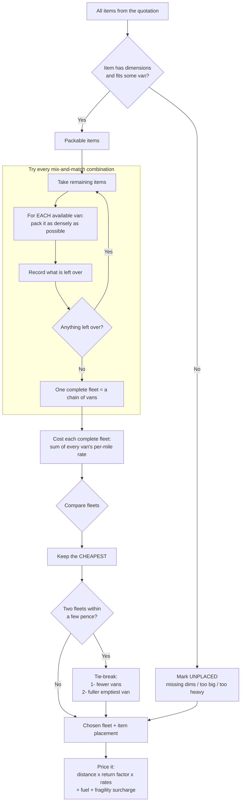
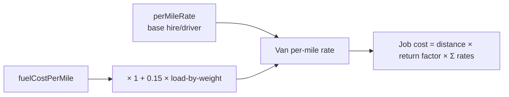
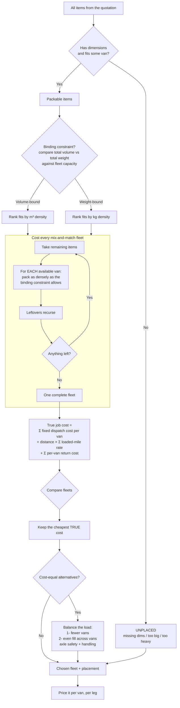
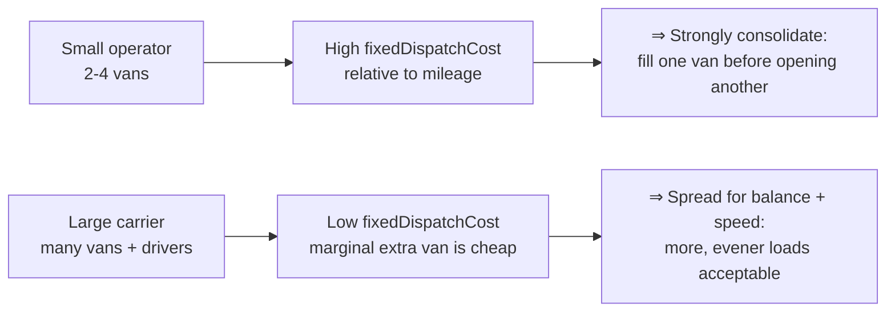

# Fleet Allocation & Quote Pricing

How the system decides **which vans carry a job, how cargo is split across them, and
what the customer pays** — including the return drive.

The objective is a single thing: **the cheapest set of vans that still carries every
item.** Fewer vans and fuller vans are only used to break ties.

Code: `src/lib/packing/fleet-allocator.ts` · cost model: `src/lib/packing/van-cost.ts`
· pricing: `src/lib/pricing/calculator.ts`.

> **This doc is in two halves.**
> **§1–§5 — how distribution works *today*** (the shipped algorithm, exactly).
> **§6–§8 — how it *should* evolve** to distribute cargo more intelligently across a
> fleet, with a model that scales from a two-van operator to a large carrier.
> Read §1–§5 to understand the current behaviour; read §6–§8 for the upgrade path.

---

## 1. The decision flow

`allocateFleet` is an **exhaustive branch-and-bound search**. The single-van
`HeuristicPacker` answers "how much fits in one van"; the allocator answers "which
fleet carries everything for the least money".

In words, at each step it:
1. tries every still-available van, packing **all remaining cargo** into it (each van
   filled as densely as the packer allows);
2. recurses on whatever that van couldn't take (`result.unplaced`);
3. keeps the cheapest total, memoised on the remaining-cargo signature + van
   availability.

> **Large jobs** cap the exhaustive search at ~1,500 combinations, then a fast greedy
> completion (pick the most volume-per-£ van each step) finishes the rest, so it always
> terminates.

---

## 2. What "cost" means for one van

Each van's cost is its **per-mile rate**. The whole job is `distance × Σ(rates)`, and
since distance is the same for every van, the search just minimises the **sum of rates**.

So **weight matters** in two ways: a heavier load raises the fuel part of the rate, and
a van is refused outright once its payload limit is exceeded (its items spill into the
next van). The cheapest fleet balances *volume that fits* against *weight carried*.

---

## 3. The variables the decision weighs

| Variable | Role |
|---|---|
| `perMileRate` | Primary cost — the quantity minimised |
| `fuelCostPerMile` × load | Heavier load → higher rate |
| van interior L×W×H | Hard limit — gates what physically fits (3D packer) |
| van `maxPayloadKg` | Hard limit — refuse once cumulative weight exceeds it |
| van `quantity` | How many of each model are available to draw on |
| `ROUTE_RETURN_FACTOR` | Multiplies billed distance (1 = one-way, 2 = round trip) |
| tie-breakers | fewer vans, then fuller vans — only on a cost tie (`betterAllocation()`) |

---

## 4. Why "Medium ¾ full + Small 100% full" happens

It is **emergent, not a rule**. Across every combination tried, that pairing carried
all items at the lowest summed rate: a small van has a low rate, so filling it
completely and topping up with the minimum extra capacity (a partly-full medium) beats
running two larger, half-empty vans. The algorithm never "aims" to fill the small van
first — cheapest-overall just lands there.

> **Data caveat:** `config/vans.json` payloads are currently inflated ~20× (see the note
> in that file), so weight rarely gates anything yet and distribution is driven mostly
> by volume. Restore realistic payloads before the weight side of "cheapest" can be
> trusted.

---

## 5. Return journey

Pricing is per-van full-route: every vehicle is billed for the same origin→destination
distance. A single config knob covers the drive home:

- `ROUTE_RETURN_FACTOR` (routing block, `src/config/env.ts`): `1.0` = one-way, `2.0` =
  full round trip (van returns to base). Default `2.0`.
- Applied in `calculateQuote`: `billedMiles = route.distanceMiles × returnFactor`,
  multiplying **both** the distance and the payload-adjusted fuel line items.
- The reported `route.distanceMiles` stays the true **one-way** figure; only billed
  miles scale. Labels show the factor, e.g. *"Distance (200.0 mi × 2 round trip @
  £1.28/mi)"*.

Because the factor multiplies **every** van's cost equally, it does **not** change the
fleet chosen in §1 — the relative ordering of combinations is preserved.

---

# How it *should* work — a smarter distribution model

§1–§5 describe what ships today. It is correct and deterministic, but its cost model is
deliberately thin, and that thinness shows up as three real-world blind spots. This half
states each blind spot precisely, then gives the upgraded decision flow that fixes them.

## 6. Where the current logic is too simple

| # | Blind spot in §1–§5 | Why it matters | Evidence in code |
|---|---|---|---|
| **A** | **No fixed cost per van.** Job cost is `distance × Σ(per-mile rates)`. Two small vans whose rates sum to one big van's rate cost the *same* — so consolidation is only a **tie-break**, never a real saving. | A real second van means a second driver, a second vehicle off the yard, a second insurance/depot slot. Dispatching fewer vans should *cost less*, not just win ties. | `van-cost.ts` returns only `perMileRate + fuel`; `betterAllocation()` puts van-count **after** cost. |
| **B** | **Fill is judged by volume only.** The greedy step ranks vans by `m³ ÷ rate`; weight enters only as a hard refuse-when-over-payload gate. | A dense, heavy load saturates **weight** long before volume. Optimising volume-per-£ then mis-distributes: one van rides at 100% volume but 30% weight while another is the reverse. | `greedyComplete` uses `Σ volume ÷ rate` as `eff`; weight only caps via `fitsAnyVan`. |
| **C** | **One flat return factor for the whole job.** `ROUTE_RETURN_FACTOR` multiplies *every* van's billed miles equally. | A multi-drop route, or a van that deadheads back while another stays out, can't be priced — every vehicle is assumed to drive the identical round trip. | `calculateQuote`: `billedMiles = distanceMiles × returnFactor`, one scalar. |

**The through-line:** today the algorithm minimises *rate per mile*. It should minimise
**true job cost = fixed dispatch cost + loaded-mile cost + return cost**, with
distribution balanced on the **binding constraint** (volume *or* weight, whichever
saturates first).

## 7. The upgraded decision flow

What changed versus §1, point by point:

1. **Binding-constraint first (fixes B).** Before searching, compare the job's total
   volume and total weight against fleet capacity and decide which one *saturates first*.
   Rank candidate vans by density on **that** axis (`m³` or `kg`), so heavy jobs stop
   being packed as if they were bulky-but-light.
2. **True cost, not rate (fixes A).** Add a `fixedDispatchCost` per van model in
   `config/vans.json` (driver day-rate share + vehicle/depot slot). The minimised
   quantity becomes `Σ fixedDispatchCost + distance × Σ loadedRate + Σ returnCost`.
   Now one van genuinely beats two when the extra vehicle's fixed cost outweighs the
   mileage saved — consolidation falls out of the *cost*, not a tie-break.
3. **Per-van return (fixes C).** Replace the single scalar with a return cost computed
   per vehicle/leg, so a van that drops and deadheads, or a multi-stop route, prices
   correctly. The flat `ROUTE_RETURN_FACTOR` stays as the default when no per-van route
   data exists.
4. **Balance as the tie-break, not just count.** When fleets are cost-equal, prefer
   fewer vans, then the **evenest fill** — avoids one van at 100% next to one at 10%,
   which is an axle-loading and handling risk, not just an aesthetic one.

## 8. Why this scales for small *and* large operators

The `fixedDispatchCost` knob is what makes one model serve both ends — it is **not** a
new algorithm per company size, just a different value in the same cost function:

- **Small operator** (every extra van is a scarce, expensive resource): set a **high**
  `fixedDispatchCost`. The cost function then refuses to open a second van unless the
  first genuinely can't take the load — the "fill the small van to 100%, top up with a
  ¾ medium" behaviour becomes a *deliberate cost outcome*, not an accident of the rates.
- **Large carrier** (vans and drivers are plentiful, throughput and safe axle loading
  matter more): set a **low** `fixedDispatchCost`. Consolidation pressure relaxes, and
  the balance tie-break spreads cargo into evener, faster-to-load vehicles.

One cost function, one config knob — the same engine quotes a man-with-a-van and a
national fleet correctly.

> **Prerequisite data fix (still open):** §4's caveat applies here too. `config/vans.json`
> payloads are inflated ~20×, so the binding-constraint logic in §7 can't distinguish
> heavy from bulky until realistic `maxPayloadKg` values are restored. That data fix is
> the first step before any of §6–§8 is worth building.

## Implementation sketch (when this is picked up)

- `config/vans.json` — add `fixedDispatchCost` per van model; restore realistic
  `maxPayloadKg`.
- `van-cost.ts` — new `computeFleetCost(vans, distance, returnPlan)` =
  `Σ fixedDispatchCost + distance × Σ loadedRate + Σ returnCost`; keep
  `computeVanCostRate` for the loaded-mile term.
- `fleet-allocator.ts` — pick binding constraint up front; minimise `computeFleetCost`
  instead of `Σ rate`; extend `betterAllocation()` tie-break to evenest-fill.
- `pricing/calculator.ts` — accept a per-van/per-leg return plan; the flat
  `ROUTE_RETURN_FACTOR` remains the fallback.

None of this is built yet — §1–§5 remain the shipped behaviour.
