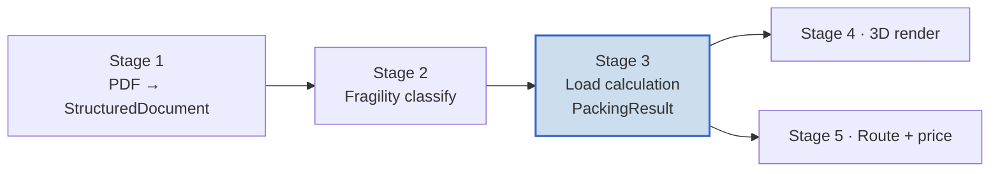
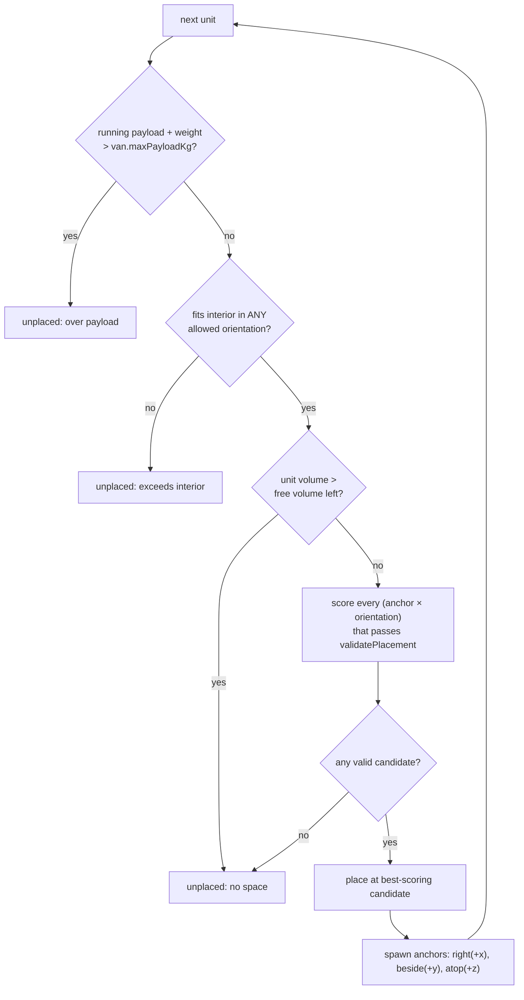
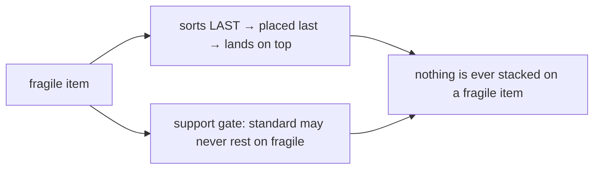
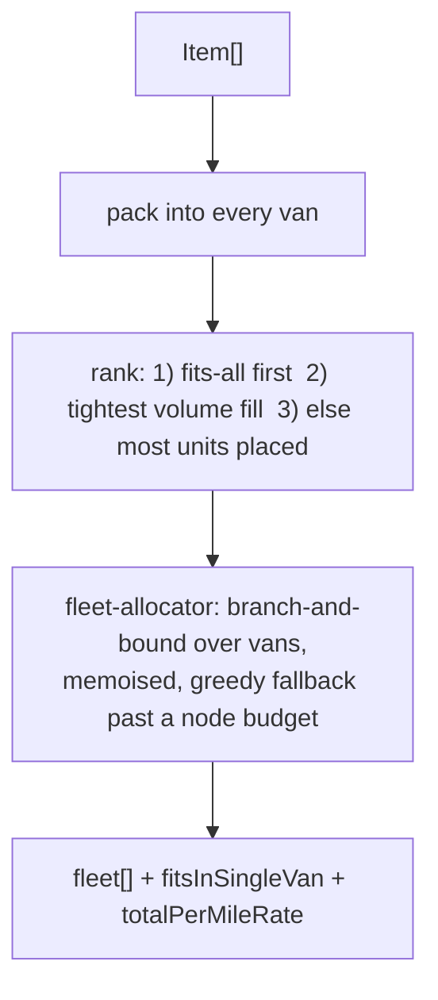

# Stage 3 — how the load is arranged (stacking & packing, from first principles)

Long-form companion to [`implementation-details.md`](implementation-details.md). It
explains, end to end, how a classified quotation becomes a concrete 3D loading
plan — with the **stacking and arranging algorithm** as the centrepiece: the exact
loops, the geometry, why fragility is a hard rule, and **where the current design
leaves space on the table** (and the single change that recovers most of it).

Everything here lives in `src/lib/packing/` and is pure, deterministic code:
same input → same plan, every time. That is what lets Stage 4 render it and lets
us test it exactly.

---

## 1. The job in one sentence

> Given a list of **items** (size, weight, fragility, stacking rules) and a fleet
> of **vans** (each an empty box with a payload limit), decide **whether** the
> items fit, **how** they stack in 3D, and **which van(s)** to use.

This is *3D bin packing*. The optimal answer is NP-hard, so we use a **greedy
heuristic** — a fast, sensible rule set that gets a good-enough plan every time.
The standard, pragmatic choice for quoting. §10 is honest about its limits.

---

## 2. Where Stage 3 sits



---

## 3. Data in, data out

**In:** a `StructuredDocument` (Stage 1 — tables of cells, the only place
**dimensions** live) and a `ClassificationResult` (Stage 2 — `fragility` + the
`(page,table,row)` coordinates, but **no sizes**). Stage 3's first job is to
**join** them back into one packable `Item`.

**Out — `PackingResult`** (pure geometry, no colours):

```
PackingResult { van, placements[], utilization, unplaced[], reasons{} }
Placement     { itemId, position{x,y,z}, size{x,y,z}, rotationIndex,
                fragile, weightKg, canSupportWeightKg, maxStackPressureKpa, stackable }
```

Coordinate system (`packing.types.ts`): origin at one bottom corner, **x = van
length, y = width, z = up**, all metres. PDF `L/H/P` map as **L→l→x, P→w→y,
H→h→z**.

---

## 4. Assembling an `Item` (the bridge step)

For each classified row, `item-assembler.ts`:

1. Looks up that row's cells in the document; parses `L/H/P` + quantity. Numbers
   are Italian (`1.234,56` = 1234.56) via `parseItalianNumber()`.
2. **Never guesses.** Any missing dimension (merged/blank cell) → `dimensions =
   null`. That unit is later surfaced as `unplaced` ("missing dimensions"),
   never invented.
3. Derives a **category** from the product code (`column-map.json`) and resolves
   its **stacking rules** (`stackability.json`).
4. Uses the explicit weight if the PDF has one, else estimates
   `volume × category density` (`weight-estimator.ts`).

The three config files (`column-map.json`, `stackability.json`, `vans.json`) are
the non-hardcoded knobs — edited without touching code.

---

## 5. The stacking matrix — what each category may do

`config/stackability.json` answers four transport questions per category. The
two that gate placement are **`stackable`** (may this sit on top of anything?)
and **`maxStackPressureKpa`** (how much vertical pressure its top face bears
before the box above is refused).

| Category | stackable? | maxStackPressureKpa (crush limit) | orientationFixed? |
|----------|:--:|:--:|:--:|
| heavy-material | yes | 300 | no |
| light-industrial | yes | 150 | no |
| base-cabinet | yes | 40 | no |
| wall-cabinet | yes | 25 | no |
| accessory | yes | 15 | no |
| appliance (oven/fridge) | **no** | 12 | yes |
| tall-unit (column) | **no** | 15 | yes |
| top (countertop/glass) | **no** | 20 | yes |
| glass-panel | **no** | 5 | yes(rot free) |
| *fallback (unknown)* | **no** | 8 | yes |

- `stackable: false` ⇒ the item may **only sit on the floor** (it is never lifted).
- `orientationFixed: true` ⇒ shipped upright; the packer won't tip it to fit.
- `maxStackPressureKpa` is the **crush gate** (see §7). `canSupportWeightKg` is
  retained in config for reference but **no longer gates placement** — pressure
  replaced raw mass so a light box on a tiny footprint can't "pass" a heavy base.
- `densityKgPerM3` is only the weight-estimator fallback. Unknown code → the
  conservative `fallback` row (nothing stacks on it, stays upright). Safe by default.

---

## 6. The arranging algorithm — the heart (`heuristic-packer.ts`)

**3D First-Fit-Decreasing with scored extreme-point placement.** Four phases.

### Phase 1 — expand to units
`quantity: 3` → 3 boxes to place. `dimensions = null` → straight to `unplaced`.

### Phase 2 — sort the units (this decides the whole layout)
A stable comparator, in priority order:

```
non-fragile first        → fragile sinks to the end, lands on top, bears nothing
then highest maxStackPressureKpa  → the sturdiest bases go down first
then largest volume       → big sturdy boxes form the floor
then id (deterministic tie-break)
```

Sturdy + heavy-bearing items land early (floor); fragile last (top). The sort is
*why* fragility becomes safe — see §8.

### Phase 3 — the placement loop
A list of candidate corners ("**anchors**", extreme points) starts at the origin
`{0,0,0}`. For each unit, in sorted order:



Two cheap gates run **before** the expensive scan: the **weight gate**
(position-independent) and a **free-volume bound** (a unit bigger than the unused
volume can't fit in any rotation). They turn hundreds of doomed units on a full
van into O(1) rejects instead of full anchor scans.

### Phase 4 — score & pick (`tryPlace` + `scoreCandidate`)
Unlike a plain "first fit", every valid `(anchor × orientation)` is **scored** and
the best wins (strictly-greater, so ties resolve to the lowest/most-compact/
lowest-rotation spot — fully deterministic):

```
score =  (stackable ? z · W_Z         : 0)   // build columns: reward height
       + (z > 0     ? SUPPORT_BONUS   : 0)   // prefer stacking over a fresh floor cell
       − (x + y)    · W_COMPACT              // hug the origin: no stranded floor gaps
       − (stackable ? size.z · W_FLAT : 0)   // lie flat on the floor → leave headroom to stack
```

with `W_Z = SUPPORT_BONUS = 1e6 ≫ W_COMPACT = W_FLAT = 1e3`, so support dominates
height dominates compaction — ties never hinge on float noise. This scoring is
what replaced an older "floor-first scan" that spread stackables across the floor
and left the air empty.

**Anchor cap.** The active anchor set is bounded at `MAX_ANCHORS = 128`: when it
grows past that, keep the lowest/most-compact (the only ones the scorer ever
prefers) and drop far corners. Bounds a pack to O(units × 128); small jobs never
reach it, so their output is byte-for-byte unchanged.

---

## 7. The placement gate — "may this box sit here?" (`placement-validator.ts`)

The **single source of truth**, imported by *both* the server packer and the
Stage-4 drag UI, so auto-pack and hand-drag obey identical physics. A candidate is
accepted only if **all** hold, in detection order (most-specific failure wins):

1. **Inside the interior** — `position + size ≤ interior` on all axes (+ `toleranceM` slack).
2. **No overlap** — strict intersection with any placed box (touching faces are fine).
3. **Supported** (only when `z > 0`) — see below. Floor boxes (`z ≈ 0`) skip it.

### The support check (`isSupported`) — and its crush model

A stacked box must rest **fully on ONE** placed box whose top face meets the box's
base (`|top − z| ≤ tol`) and that passes two gates:

- **Fragility** — a fragile box may rest only on another fragile box; a standard
  box may never sit on a fragile base. (Standard bases take anything.)
- **Crush** — the candidate's downward pressure `P = (m·g)/(footprint area)` in
  kPa must not exceed the base's `maxStackPressureKpa`. Pressure, not raw mass, so
  a small dense box can't pass a wide light base it would punch through.

> Vertical pressure only; horizontal forces and weight propagation down a column
> are out of scope by design. Total mass is still bounded globally by the van payload.

---

## 8. Why fragility is a hard rule (two independent guarantees)



The sort puts fragile on top, *and* the gate refuses any standard box resting on a
fragile base. Either alone suffices; together they make the invariant robust.

---

## 9. Choosing the van(s) — ranking & fleet allocation

`packer.service.ts` packs the job into **every** fleet van and ranks the results;
`fleet-allocator.ts` then finds the **cheapest set of vans that carries the whole
job** when one van overflows.



Cost model: `total = distance × Σ(cost-per-mile)`; distance is constant at
allocation time, so minimising `Σ cost-rate` over the chosen fleet minimises £.
We never just say "doesn't fit" — we return the best plan, the van set, and an
honest `fitsInSingleVan` flag. **Utilization** = Σ placed box volume ÷ van
interior volume (0..1); **floor coverage** = Σ floor-resting footprint ÷ floor
area — the gap between the two is exactly the wasted headroom.

---

## 10. Where space is lost — limits & the highest-leverage improvement

A real symptom: a van fills to **93.5% floor but only 76.5% volume**, with payload
at 2.56% — so the air above the floor is wasted and items spill to the next van,
even though weight is nowhere near the limit. The cause is in the arranging logic,
in leverage order:

**1 — Single-base support is the dominant cap.** `isSupported` requires a stacked
box to rest on **one** base that covers its whole footprint (§7). So columns can
never grow in footprint, and **no box can bridge two boxes**. In a mixed load
almost nothing qualifies → the floor tiles up and the upper half stays empty.
→ **Fix (highest leverage): bridging / union support.** Accept a box when the
*combined coplanar top faces* of several qualifying bases cover its footprint —
each base still passing the fragility + crush gate. This is physically real (a
board across two cabinets) and unlocks the whole upper half. Biggest single win.

**2 — Lossy extreme points.** `nextAnchors` spawns anchors only at the 3 corners
of each placed box, with **no projection** onto other boxes' faces or the walls.
True extreme-point packing projects each new point, generating the real corners of
the residual space. Without it, valid pockets get no anchor and stay empty.
→ **Fix:** project spawned points onto existing faces + interior walls.

**3 — Single greedy pass.** Once placed, a box is frozen; gaps opened as the
layout evolves are never reclaimed. → **Fix:** a cheap "settle" pass that pushes
each box toward the floor/origin until blocked.

Do these in order — **#1 alone recovers most of the lost volume**. Each is its own
branch with its own tests (the gate is shared with the drag UI, so changing it
ripples into Stage 4).

---

## 11. Why it's built this way

- **Pure & deterministic** — no clocks, no randomness, stable sorts. Same input →
  same plan. Testable; Stage 4 renders it as a pure function.
- **Config-driven** — stacking matrix, fleet, tolerance, fleet cap all in JSON /
  `env.ts`. Behaviour changes without code changes.
- **Swap-seams** — `Packer` and `VanRepository` are interfaces; the heuristic can
  be replaced (e.g. by a bridging-aware packer) without touching callers.
- **Loud failure** — bad config throws; unfit items surface with reasons, never dropped.

---

## 12. File map

| File | Role |
|------|------|
| `packing.types.ts` | All Stage 3 types (`Item`, `Van`, `Placement`, `PackingResult`, `Packer`). |
| `geometry.ts` | Volume / surface formulas (m → m²/m³). |
| `weight-estimator.ts` | Explicit-or-estimated weight. |
| `stackability.ts` + `config/stackability.json` | Category → stacking rules, crush limits, density. |
| `column-map.ts` + `config/column-map.json` | Table columns + category code patterns. |
| `item-assembler.ts` | Joins Stage 1 + Stage 2 → `Item[]`. |
| `van.repository.ts` + `config/vans.json` | The fleet. |
| **`heuristic-packer.ts`** | **The arranging algorithm: sort, anchor loop, scoring (§6).** |
| **`placement-validator.ts`** | **The placement gate: bounds, overlap, support/crush (§7) — shared with Stage 4.** |
| `packer.service.ts` | Orchestrates assembly + ranking. |
| `fleet-allocator.ts` | Cheapest multi-van plan when one van overflows (§9). |
| `__tests__/` | Tests pinning all of the above. |
