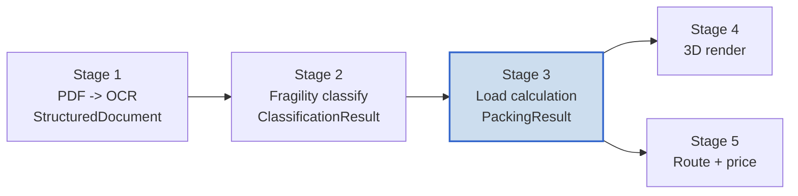
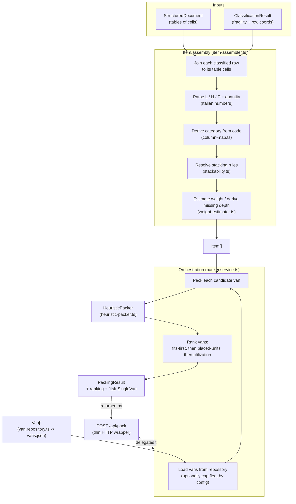
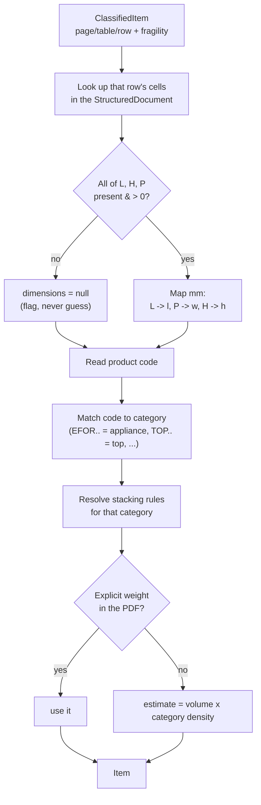
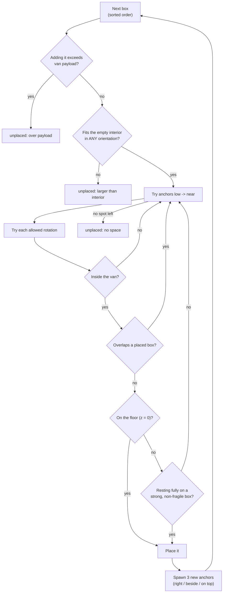
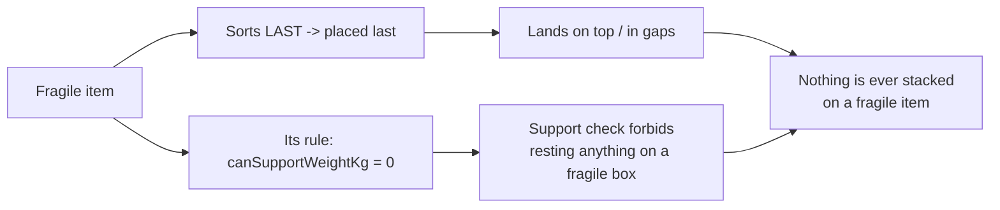
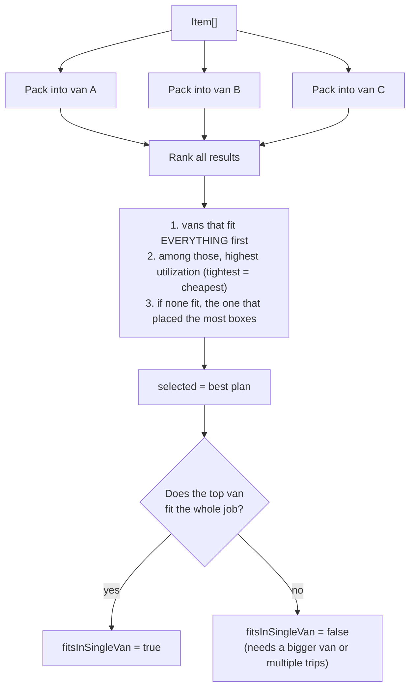

This is the long-form companion to [`implementation-details.md`](implementation-details.md).
It explains, end to end, how a classified quotation becomes a concrete 3D loading
plan: what data goes in, every transform it passes through, how the packing
algorithm decides where each box goes, and how fragility becomes a hard rule.

Everything here lives in `src/lib/packing/` and is pure, deterministic code —
given the same input it always produces the same plan, which is what lets Stage 4
render it and lets us test it exactly.

---

## 1. The job in one sentence

> Given a list of **items** (each with size, weight, fragility) and a fleet of
> **vans** (each an empty box with a weight limit), figure out **whether** the
> items fit, **how** they stack in 3D, and **which van** (or how many) to use.

This is the *3D bin-packing problem*. Finding the mathematically perfect packing
is NP-hard (impractical to compute exactly), so we use a **greedy heuristic** —
a fast, sensible set of rules that gets a good-enough answer every time. That is
the standard, pragmatic choice for quoting.

---

## 2. Where Stage 3 sits in the pipeline



Stage 3 consumes the output of Stages 1 and 2 and produces a `PackingResult`,
which Stages 4 and 5 both read.

---

## 3. The data it starts and ends with

**Inputs**

- `StructuredDocument` (Stage 1) — the PDF as pages of tables; each table is a
  grid of string cells. This is where the **dimensions** physically live.
- `ClassificationResult` (Stage 2) — a list of `ClassifiedItem`, one per product
  row, carrying its **fragility** and the `(pageIndex, tableIndex, rowIndex)`
  coordinates that point back into the document.

**The bridge problem:** Stage 2 tells us *what is fragile* but carries **no
sizes**. Stage 1 has the sizes but no fragility. Stage 3's first job is to join
them back together into a single packable `Item`.

**Output — `PackingResult`**

```
PackingResult {
  van            // which van this plan is for
  placements[]   // each placed box: itemId, position {x,y,z}, size, rotation, fragile, weight
  utilization    // 0..1, how full the van is by volume
  unplaced[]     // items (or leftover quantity) that did not fit
  reasons{}      // itemId -> why it could not be placed
}
```

It is **pure geometry** — no colors, no rendering. Stage 4 turns it into pictures.

---

## 4. The full flow



The three configuration files (`column-map.json`, `stackability.json`,
`vans.json`) are the *non-hardcoded knobs* — they can be edited without touching
code.

---

## 5. Step-by-step: assembling an `Item`

For **each** classified row, `item-assembler.ts` does this:



Two design rules worth calling out:

- **Never guess (CLAUDE.md).** If a row is missing a dimension (merged cell,
  blank), we set `dimensions = null` rather than inventing a size. That item is
  later reported as `unplaced` with the reason *"missing or unparseable
  dimensions"* — visible, not silently dropped.
- **Italian numbers.** The source PDF writes `1.234,56` (dot = thousands, comma =
  decimal). `parseItalianNumber()` converts it to `1234.56`, carried over from
  the reference parser.

### The dimension axis mapping

The PDF gives `L` (length), `H` (height), `P` (depth, *profondità*). The van's
coordinate system is `x` = length, `y` = width, `z` = up. So:

| PDF | meaning | our field | van axis |
|-----|---------|-----------|----------|
| L | length | `l` | x |
| P | depth | `w` | y |
| H | height | `h` | z |

---

## 6. The stacking matrix (why some boxes can bear weight and some can't)

`config/stackability.json` encodes the matrix from `van-calculation.md`. Each
**category** answers three transport questions:

| Category | Stackable? (can sit on others) | Can support weight on top? | Rotation locked? |
|----------|:--:|:--:|:--:|
| appliance (oven, fridge) | no | no (0 kg) | yes (upright) |
| top (countertop, glass) | no | no (0 kg) | yes |
| base-cabinet (solid box) | yes | yes (strong, 80 kg) | no |
| wall-cabinet (lighter) | yes | yes (limited, 30 kg) | no |
| tall-unit (column/pantry) | no | no (0 kg) | yes |
| accessory (handles, parts) | yes | yes (20 kg) | no |

- `canSupportWeightKg = 0` ⇒ **nothing may be stacked on it** (it is, in effect,
  fragile-as-a-base).
- `orientationFixed = true` ⇒ it must stay upright; the packer won't tip it on
  its side to make it fit.
- Each row also carries a `densityKgPerM3` — the fallback used to *estimate*
  weight when the PDF has none. Values lean heavy on purpose, so we never
  under-count weight and overload a van.

Unknown category ⇒ the **conservative `fallback`** row (nothing stacks on it, no
rotation). Safe by default.

---

## 7. The packing algorithm (the heart)

`heuristic-packer.ts` implements **3D First-Fit-Decreasing** with *extreme-point*
placement. Plain-English version:

1. **Expand quantities.** An item with `quantity: 3` becomes 3 separate boxes to
   place. Items with `dimensions = null` go straight to `unplaced`.
2. **Sort the boxes.** Non-fragile first, then biggest-volume first (ties broken
   by id for determinism). Heavy, sturdy things get placed early → they land on
   the floor. Fragile things sort last → they end up on top, where nothing can be
   placed on them.
3. **Place each box at the best free spot.** We keep a list of candidate corners
   ("anchors"), starting with the van's origin corner. For each box we try anchors
   **lowest-first, then nearest** (fill the floor before stacking), and at each
   anchor we try the allowed rotations. The first spot that passes every check
   wins.
4. **After placing, spawn new anchors** at the three exposed corners of the box
   just placed (to its right, beside it, and on top of it). These become future
   candidate spots.



### The checks, precisely

For a candidate position + rotation, a box is accepted only if **all** hold:

- **Weight gate (first, position-independent):** running payload + this box's
  weight ≤ `van.maxPayloadKg`. Fail → unplaced, reason *over payload*.
- **Fits the interior:** `position + size ≤ interior` on all three axes (with a
  small `toleranceMm` slack). If it can't fit in *any* orientation even in an
  empty van → unplaced, reason *larger than interior*.
- **No overlap:** its box must not intersect any already-placed box (touching
  faces are fine, true overlap is not).
- **Support (only when stacked, z > 0):** it must be `stackable`, **and** it must
  rest fully on top of **one** placed box that is (a) **not fragile** and (b)
  rated to bear this box's weight (`canSupportWeightKg ≥ weight`). This is the
  conservative "no partial support" rule — a box never balances on an edge.

### How fragility becomes a hard rule



Two independent mechanisms guarantee the same invariant — a fragile item is never
load-bearing: it is placed last (so it's on top), **and** the support check
explicitly refuses any non-fragile box from resting on it.

### Utilization

After packing: `utilization = (sum of placed box volumes) / (van interior
volume)`, a number from 0 to 1. Higher = tighter packing = the van is well used.

---

## 8. Choosing the van (ranking)

`packer.service.ts` doesn't trust a single van — it runs the packer against
**every** van in the fleet and ranks the results:



So the result is always the *best available* plan plus an honest
`fitsInSingleVan` flag. We never just throw "doesn't fit" — we say which van got
closest and why the rest didn't.

---

## 9. A worked example (the real smoke-test run)

Input: 4 product rows from an Arredo3-style quote.

| Row | Code | Qty | L×H×P (mm) | Fragility | Becomes |
|-----|------|-----|-----------|-----------|---------|
| 1 | EFOR600 | 1 | 598×595×550 | fragile | appliance, 1 unit |
| 2 | BASE600 | 3 | 600×720×560 | standard | base-cabinet, 3 units |
| 3 | COL3060 | 1 | 600×2000×580 | standard | tall-unit, 1 unit |
| 4 | TOP120 | 1 | 1200×40×(blank) | standard | top, **dimensions null** |

Result:

- **packableUnits = 5** (oven 1 + base 3 + column 1; the top has no depth so it's
  not packable).
- **placed = 4** (oven + 3 bases) into the smallest van (Fiat Doblò), utilization
  ≈ 0.19.
- **unplaced:**
  - `TOP120` → *missing or unparseable dimensions* (blank depth — flagged, not
    guessed).
  - `COL3060` → *larger than the van interior in every orientation* (2000 mm tall
    exceeds every van's height, and as a tall-unit it can't be laid down).
- **fitsInSingleVan = false** — correctly, because the 2 m column physically
  doesn't fit any configured van.

This is the system being honest: it placed what it could, and told us exactly why
the other two couldn't go — rather than silently producing a wrong quote.

---

## 10. Why it's built this way (design notes)

- **Pure & deterministic.** No clocks, no randomness, stable sorts. Same input →
  same plan, every time. That's what makes it testable and what lets Stage 4
  render it as a pure function.
- **Config-driven, never hardcoded.** Column positions, the stacking matrix, the
  van fleet, and tuning knobs (tolerance, density, fleet cap) all live in JSON /
  `env.ts`, editable without code changes.
- **Swap-seams.** `Packer` and `VanRepository` are interfaces. The heuristic can
  be replaced with a smarter algorithm, and `vans.json` can be swapped for the
  ML-1 admin database, without touching anything that calls them.
- **Loud failure.** Bad config throws immediately with a clear message; un-fit
  items are surfaced with reasons, never dropped.

---

## 11. File map (for navigation)

| File | What it does |
|------|--------------|
| `src/lib/packing/packing.types.ts` | All Stage 3 types (`Item`, `Van`, `Placement`, `PackingResult`, `Packer`). |
| `src/lib/packing/geometry.ts` | Volume / surface formulas (mm → m³/m²). |
| `src/lib/packing/weight-estimator.ts` | Explicit-or-estimated weight. |
| `src/lib/packing/stackability.ts` + `config/stackability.json` | Category → stacking rules + density. |
| `src/lib/packing/column-map.ts` + `config/column-map.json` | Table columns + category code patterns. |
| `src/lib/packing/item-assembler.ts` | Joins Stage 1 + Stage 2 → `Item[]`. |
| `src/lib/packing/van.repository.ts` + `config/vans.json` | The fleet. |
| `src/lib/packing/heuristic-packer.ts` | The packing algorithm + constraints. |
| `src/lib/packing/packer.service.ts` | Orchestrates assembly + ranking. |
| `src/app/api/pack/route.ts` | HTTP entry point. |
| `src/lib/packing/__tests__/` | 26 tests proving all of the above. |
```
